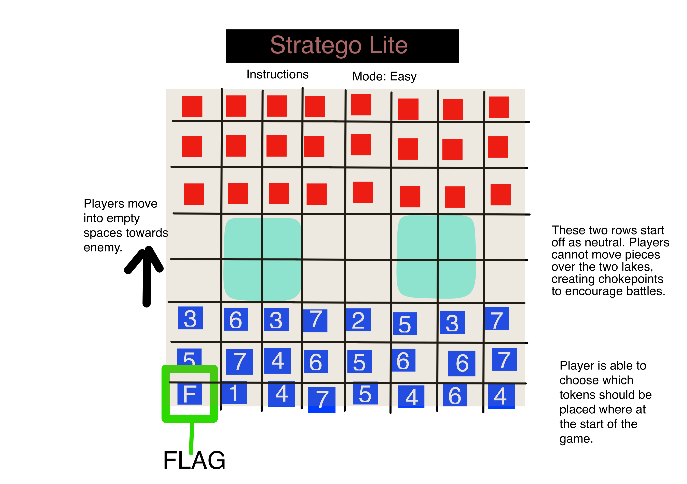

# Project 1 Pitch: Stratego Lite 
[Stratego](https://en.wikipedia.org/wiki/Stratego) is a classic board game consisting of a battlefield where two players each attempt to capture the opponent's flag. Are you ready to command your battalion to victory? 

The gameboard is the battlefield. Hurry up! The battle is starting soon. During the calm before the storm, set up your pieces strategically to maximize offensive and defensive output. Once battle commences, charge your pieces forward to get to your opponent's flag. Careful! Don't get too aggresive or you might get outflanked, and watch out for bombs and that pesky spy! Use your scouts to 'scout' the battlefield. Utilize your stronger soldiers to their fullest potential. In a game of sacrifice, constant risk-vs-reward assesments, and ultimate strategy and bluffing, inspire your troops for greatness. Bring your army to victory by sheer force of will. 

## Background of Stratego Rules
The gameboard consists of 100 spaces. At the start of the match, each player sets up their board with their army of 40. 

The army consists of:

* 1 Marshal (rank 1) 
* 1 General (rank 2) 
* 2 Colonels (rank 3)
* 3 Majors (rank 4)
* 4 Captains (rank 5)
* 4 Lieutenants (rank 6)
* 4 Sergeants (rank 7)
* 5 Miners (rank 8)
* 8 Scouts (rank 9)
* 1 Spy (rank S)
* 6 Bombs (rank B)
* 1 Flag (rank F)

Each player sets up the board to their liking. All 40 pieces must be initially contained within the first four rows of each player's side. Due to token design, players can only see their own soldiers' ranks. Opponent ranks are hidden until battles are initiated. 

After board set-up, players alternate turns moving one of their pieces to an open space horizontally or vertically (no diagonal movement). Soldiers can only move to an empty space, or initiate battle. They cannot jump over occupied spaces. A soldier can initiate battle with an opposing soldier by simply moving onto the same space as the enemy. Once battle is initiated, both players reveal the rank of their soldier. The soldier with the stronger (lower number) rank wins, e.g. a Marshal will always beat a Lieutenant. The losing piece is removed from gameplay. If there is a tie, both pieces are removed. 

A player wins when he captures the opponent's flag or eliminates all their moving pieces. 

### Special Properties 
Some soldiers have special properties. 

* Marshal will beat almost any other piece when initiating battle, except another Marshal. However, if an enemy spy initiates battle with a Marshal, the Spy will win. 
* Miner can disable bombs and remove them from the playing board. 
* Scouts can move as many spaces in a single direction as possible per turn. For example, if there is a stretch of 5 empty spaces in a row, the scout can move through them. However, this does reveal the rank of the soldier to the opponent. 
* Once bombs are placed during set up, they cannot be moved or jumped over. Only an opposing Miner can remove a bomb. The bomb will remain active until removed by a Miner. 
* The Spy can only beat one person in battle: the Marshal. And he can only win by initiating the fight. 
* The main goal is to capture the Flag token. Once placed, players cannot move their flag. The flag is captured once an enemy initiates battle with it. Usually, it is good practice to protect your flag with bombs. 

# Tech stacks

HTML, CSS, JavaScript, HTML 5 Canvas 

# WireFrame 

# Minimum Viable Product

The minimum viable product will be 'Stratego-Lite.' It is not as complex as the original game. At minimum, the project should have the following: 

* A start Screen with game-play instructions and start button. 
* Canvas game screen that displays the gameboard, and updates token positions and status.
* A gameboard of 8 x 8 squares
* Each player gets 24 soldiers, they can place them however they like within the first three rows of their side. 
* DO NOT INCLUDE SPECIAL SOLDIERS. Only include soldiers rank 1-6. There will be no bombs, no spies, no miners, no scouts. Soldiers only win a battle by being a stronger rank. 
    - Soldiers: 
        * Marshal       Rank 1    (total: 1)
        * General       Rank 2    (total: 1)
        * Colonel       Rank 3    (total: 3)
        * Major         Rank 4    (total: 4)
        * Captain       Rank 5    (total: 4)
        * Lieutenant    Rank 6    (total: 5)
        * Sergeant      Rank 7    (total: 5)
    - May have to tinker with totals to fine tune gameplay
* Tokens will be displayed by a number in a square or circle. Player will be able to move these tokens where they want. 
* Ability for player to confirm their initial configuration. 
* A computer opponent that will set up its pieces randomly (constraining to the same rules as above)
    - The computer will move one their pieces randomly each turn. 
    - Computer's soldier's ranks must not be visible until they engage in a battle. 
    - Computer must place flag in the back row 
* Each player's movement must be restricted to one space per turn. The space may be horizontally or vertically adjacent. If it is occupied by a friendly soldier or the lake chokepoint, the space must be blocked. If it is occcupied by an enemy soldier, the two soldiers will battle. 
* When soldiers battle, the stronger ranked soldier will win and occupy the space. The weaker soldier will be removed from the game. 
* Once the flag is captured or all enemy pieces are defeated, the game is over. 
* winning player will be recognized 
* reset gameboard option 

# Stretch Goals 

* Make the gameboard larger (10 x 10)
* Include all special soldiers/tokens and bombs, and add their properties: 
    - Include special Scout movement property (can move more than one space in a single direction per turn)
    - Include special Spy properties, so that it can defeat the Marshall if it initiates the fight. 
    - Include miner that can defuse a bomb. 
* Render a battle animation. When two soldiers meet, the winner will kick the loser off screen 
* Render a bomb exploding animation
* Render a bomb diffusing animation
* Add hard mode. Adds game logic to the CPU. Make it remember where bombs are, remember the ranks of soldiers it battles. Will be smarter about engaging battles if it knows it can't win. 
* Make it look nicer. Be creative. Add unique images for each soldier rank 
* Add another gamemode Player vs player. 
    - May have to create another game screen. Since this game relies on players not knowing the ranks of the opposing soldiers, we can't have both players looking at the same screen. 
    - Obviously, it won't be online mode. But it would be interesting to create two screens side by side and have them update with each other (each player plays on their own game screen, but it will all be within the same webpage for the scope of this project. )
* Add Tournament rule options, which can be found on the wikepedia Stratego site linked above. 
* Add aesthetics to mimic the style of original stratego 

# Roadblocks

* Canvas. I may be complicating things by introducing canvas into it, but I wanted to see what I could do with it. Being a grid setup, it might be easier just use DOM manipulation, but I think with canvas I can introduce some smooth animations and keep track of each token easily  
* This game has a lot of specific rules so it may be a bit complex to get everything working together. 

# Project Link: 

https://mitchdmarino.github.io/Stratego-mock/

